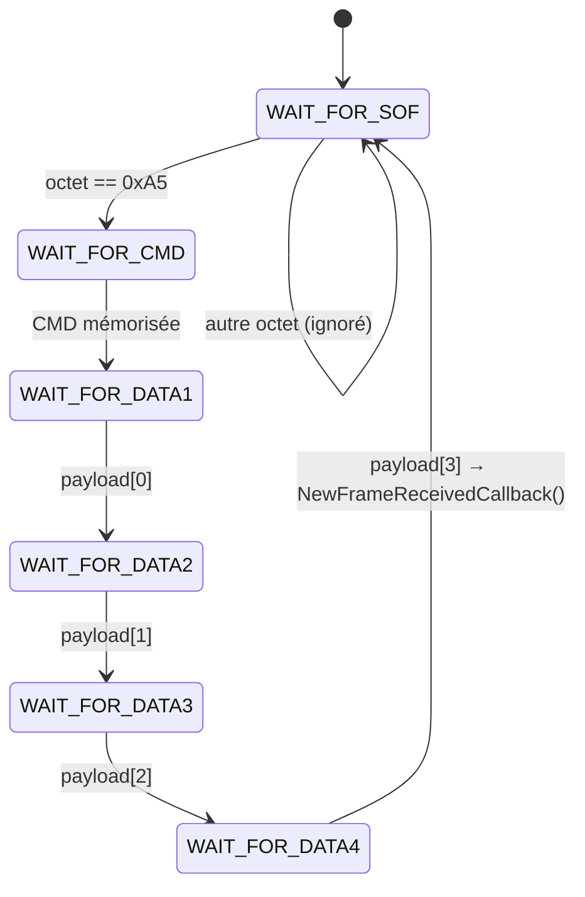

# Protocole UART et machine d'états

Ce document décrit le protocole série « maison » utilisé entre chaque nœud STM32 (pont CAN ↔ UART) et le dashboard Python.

## 1. Liaison physique

| Paramètre | Valeur |
|---|---|
| Périphérique STM32 | LPUART1 |
| Débit | 115 200 bauds |
| Format | 8 bits de données, sans parité, 1 bit de stop (8N1) |
| Contrôle de flux | Aucun |
| Réception STM32 | Interruption, 1 octet à la fois (`HAL_UART_Receive_IT`) |
| Émission STM32 | Interruption (`HAL_UART_Transmit_IT`) |
| Côté PC | `pyserial`, thread de lecture dédié (`SerialReader`) |

## 2. Format de trame

Le format est **identique dans les deux sens** (STM32 → PC et PC → STM32). Une trame fait toujours **6 octets**.

```
 Octet 0   Octet 1   Octets 2 à 5
+--------+---------+-----------------------------+
|  SOF   |   CMD   |     DATA (4 octets, BE)     |
| 0xA5   | 1 octet |  uint32 big-endian          |
+--------+---------+-----------------------------+
```

| Champ | Taille | Description |
|---|---|---|
| `SOF` | 1 octet | *Start Of Frame*, valeur fixe `0xA5`. Sert de délimiteur et de point de resynchronisation. |
| `CMD` | 1 octet | Code identifiant la donnée (STM32 → PC) ou la commande (PC → STM32). |
| `DATA` | 4 octets | Charge utile. Dans le sens STM32 → PC, ce sont les 4 premiers octets de la trame CAN reçue (`data[0]` à `data[3]`). |

### Structure C (firmware)

```c
typedef struct {
    uint8_t cmd;
    uint8_t payload[4];
} FrameCom;
```

### Exemple

Trame de température (CAN `0x456`, valeur 0x2A = 42 °C) :

```
A5 33 00 00 00 2A
│  │  └──────────┴── DATA = 0x0000002A
│  └── CMD = 0x33 (température)
└── SOF
```

## 3. Machine d'états de réception (STM32)

La reconstruction de la trame est faite octet par octet dans `HAL_UART_RxCpltCallback`.



| État | Action à la réception d'un octet |
|---|---|
| `WAIT_FOR_SOF` | Si l'octet vaut `0xA5` → passer à `WAIT_FOR_CMD`, sinon l'ignorer |
| `WAIT_FOR_CMD` | Mémoriser `cmd` → `WAIT_FOR_DATA1` |
| `WAIT_FOR_DATA1` | Mémoriser `payload[0]` → `WAIT_FOR_DATA2` |
| `WAIT_FOR_DATA2` | Mémoriser `payload[1]` → `WAIT_FOR_DATA3` |
| `WAIT_FOR_DATA3` | Mémoriser `payload[2]` → `WAIT_FOR_DATA4` |
| `WAIT_FOR_DATA4` | Mémoriser `payload[3]`, traiter la trame complète, retour à `WAIT_FOR_SOF` |

Après chaque octet, la réception est ré-armée (`HAL_UART_Receive_IT`) pour l'octet suivant.

**Intérêt de la machine d'états** : en cas d'octet perdu ou de démarrage en milieu de flux, le récepteur ignore les octets jusqu'au prochain `0xA5` et se recale automatiquement sur le début d'une trame.

## 4. Réception côté PC

Le thread `SerialReader` :

1. accumule les octets reçus dans un tampon ;
2. cherche `0xA5` dans le tampon et élimine les octets qui le précèdent ;
3. quand 6 octets sont disponibles, extrait la trame ;
4. décode `CMD = frame[1]` et `valeur = struct.unpack('>I', frame[2:6])` ;
5. émet les signaux Qt `sig_frame` (décodage) et `sig_raw` (journal).

Émission PC → STM32 : `struct.pack('>BBI', SOF, cmd, data)`.

## 5. Émission côté STM32

`SendFrameUart()` remplit un buffer **global** (`uart_tx_buffer[6]`) puis appelle `HAL_UART_Transmit_IT`.

> Le buffer doit rester valide pendant toute la transmission, car `HAL_UART_Transmit_IT` ne copie pas les données. Un buffer local provoquerait des trames corrompues.

## 6. Commandes

Voir [`can_ids.md`](can_ids.md) pour la correspondance complète entre identifiants CAN, codes `CMD` et actions.