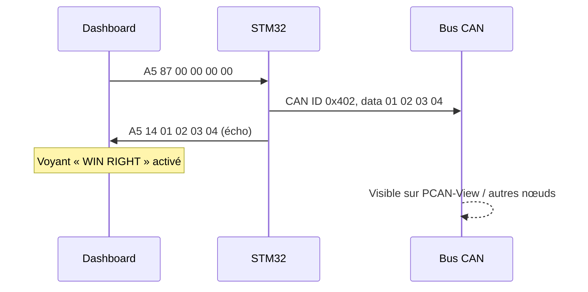

# Identifiants CAN et commandes

## 1. Trames CAN → UART (STM32 → PC)

Quand un nœud reçoit une trame CAN, il la retransmet au dashboard dans une trame UART `[0xA5][CMD][DATA×4]`. Le `switch` de `HAL_FDCAN_RxFifo0Callback` associe chaque ID à un code `CMD`.

| ID CAN | CMD UART | Signification | Unité / type | Octet utile | Affichage dashboard |
|---|---|---|---|---|---|
| `0x406` | `0x30` | Vitesse moteur | rpm | `data[0]` | Jauge « Speed Motor » |
| `0x55C` | `0x31` | Pression | bar | `data[3]` | Jauge « Pressure » |
| `0x456` | `0x33` | Température | °C | `data[3]` | Jauge « Temperature » |
| `0x390` | `0x10` | Débit d'air | g/s | `data[3]` | Jauge « Débit Air » |
| `0x221` | `0x11` | Batterie | V | `data[3]` | — |
| `0x679` | `0x88` | Notification ABS | événement (bascule) | — | Voyant ABS |
| `0x790` | `0x12` | Notification porte droite | événement (bascule) | — | Voyant porte droite |
| `0x222` | `0x13` | Notification éclairage extérieur | événement (bascule) | — | Voyant |
| `0x401` | `0x35` | Notification vitre gauche | événement (bascule) | — | Voyant vitre gauche |
| `0x402` | `0x14` | Notification vitre droite | événement (bascule) | — | Voyant vitre droite |

**Notes**
- Les notifications sont des **événements** : chaque trame reçue **bascule** l'état (ouvert ↔ fermé, actif ↔ inactif).
- Les identifiants ID `0x406` / `0x55C` / `0x456` / `0x390` / `0x221` transportent des valeurs numériques (capteurs simulés).
- Les IDs sont à **priorité décroissante quand la valeur augmente** (arbitrage CAN : le plus petit ID gagne).
- Tout ID inconnu est ignoré par le firmware.

## 2. Commandes UART → CAN (PC → STM32)

Le dashboard envoie une trame UART ; le firmware l'interprète dans `NewFrameReceivedCallback` et émet une trame CAN.

| CMD UART | Commande | Action | Trame CAN émise | Statut |
|---|---|---|---|---|
| `0x87` | Vitre droite | Actionner la vitre droite | ID `0x402`, données `01 02 03 04` | Implémenté ; le STM32 renvoie aussi un écho UART (`CMD 0x14`) |
| `0x89` | Vitre gauche | Actionner la vitre gauche | — | Réservé |
| `0x90` | Trigger ABS | Déclencher l'ABS (test) | — | Réservé |
| `0x91` | Porte gauche | Ouvrir la porte gauche | — | Réservé |

Toute commande inconnue est ignorée silencieusement.

## 3. Exemple de flux complet : vitre droite

## 4. Émission périodique

Dans la boucle principale, chaque nœud émet sa trame périodique. Exemple du nœud de température :

- ID `0x456`, 8 octets, toutes les **500 ms** ;
- `data[3]` = compteur incrémenté à chaque émission (valeur simulée) ;
- la trame est aussi relayée vers le dashboard local via UART.

## 5. Vérification sur le bus

| Outil | Ce qu'on vérifie |
|---|---|
| **PCAN-View** | IDs, DLC, données, période d'émission de chaque trame |
| **Saleae Logic 2** | Signaux CAN / UART, timing des bits, décodage des trames UART `A5 …` |
